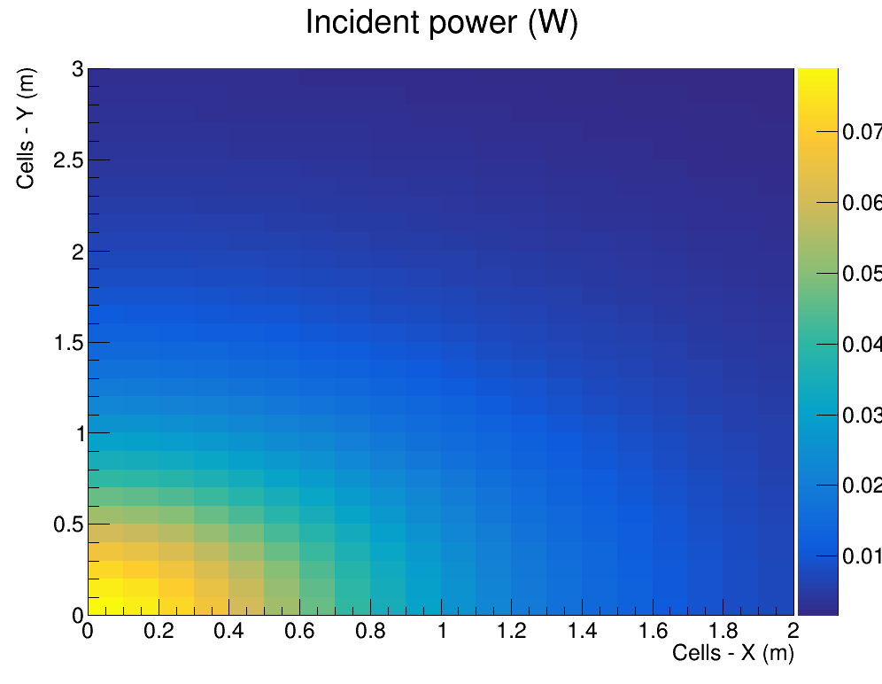
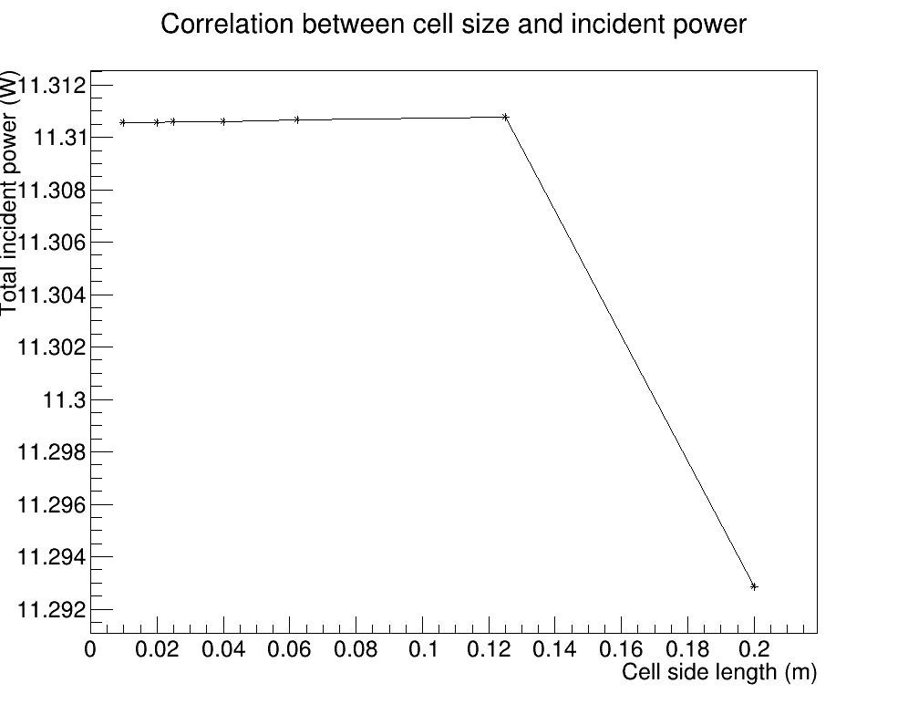

# Overview
This repository comprises of 5 projects which I and my colleague Duarte Tavares have developed in our Computational Physics course, at IST, BSc in Engineering Physics, first year.

# Project 1 - Image Processing

*Original Picture*

*Inclusive Box Filter*

*Exclusive Box Filter*

*Median Filter - Diamond Shape*

*Median Filter - Box Shape*

# Project 2 - Irradiance of light on a panel

*Irradiance Map*

*Total Power Received VS. Cell Division*
