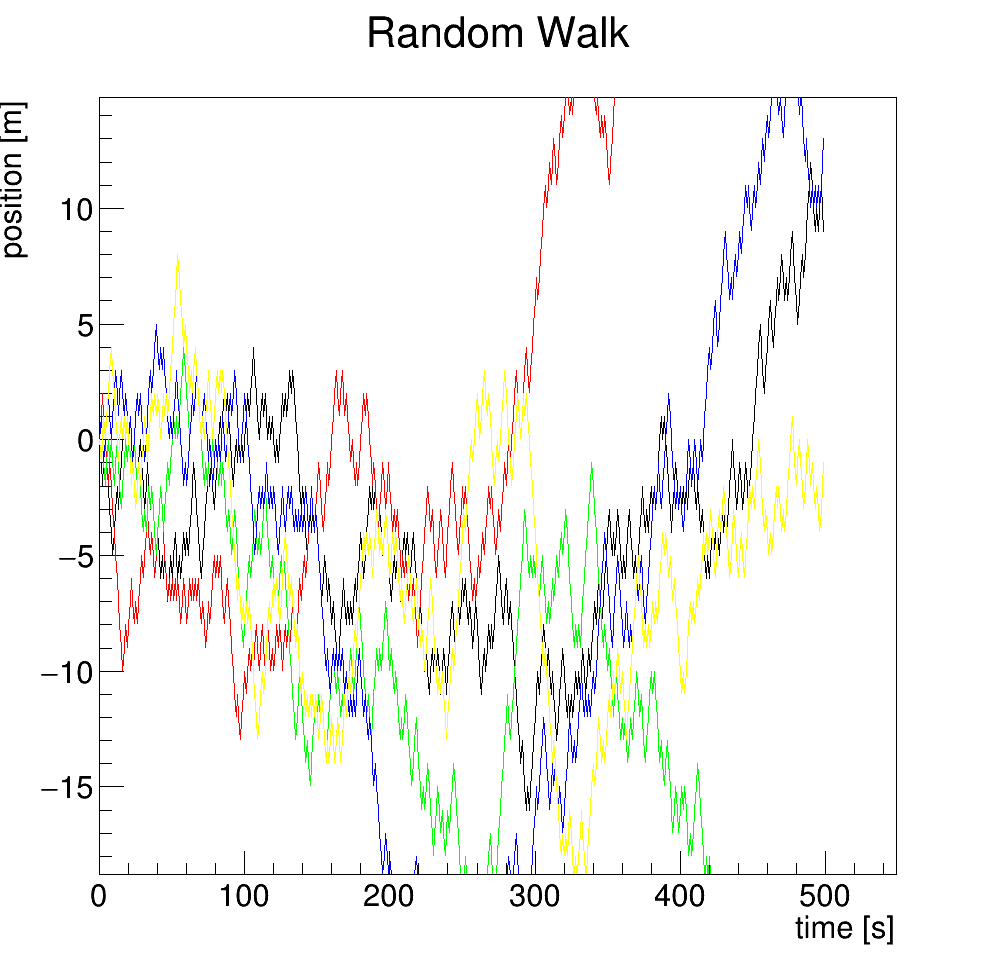
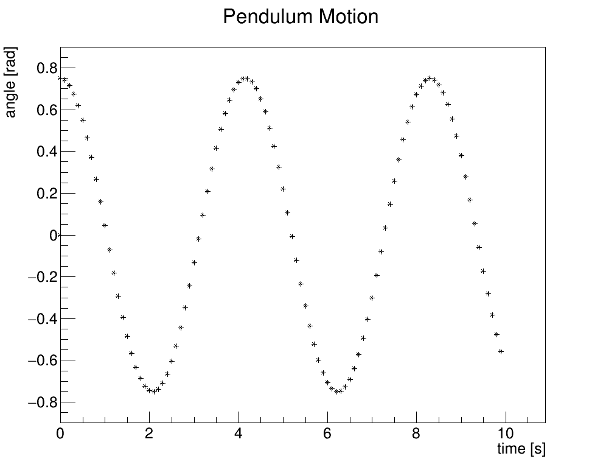

# Overview
This repository comprises of 5 projects which I and my colleague Duarte Tavares have developed in our Computational Physics course, at IST, BSc in Engineering Physics, first year.

# Project 1 - Image Processing

This project is about opening and writing files in C++, the PGM file format, and the various techniques one can remove noise from noisy images. These techniques are used in graphics and astrophysics, to name a few.

*Original Picture*

*Inclusive Box Filter*

*Exclusive Box Filter*

*Median Filter - Diamond Shape*

*Median Filter - Box Shape*

# Project 2 - Irradiance of light on a panel

This project comprised of the computational modelling of a simple system: A punctual light source, and a panel, which receives the radiation. This project explores the importance of floating point errors for physical modelling, and the usage of ROOT to make useful graphs.

*Irradiance Map*

*Total Power Received VS. Cell Division*

# Project 3 - Solving Linear Systems

This project aims to show how matrices can be used to solve linear systems which represent physical systems, such as circuits. The Eigen library was used.

*The probem: Solving this circuit using matrices.*

*The Equations of this particular system*

# Project 4 - Random Numbers (Random Walk), Derivation and Integration

This project has two parts: the first part is about the usage of random numbers in physics, such as in random walks (which model brownian motion, for example), and the second part is about making integrals and derivatives computationally, returning numeric values.

*Multiple Random Walks, equal probabilities*

*Test of the display of a graph using ROOT*

# Project 5 - ODEs Solver (Pendulum Example)

This project aims to build a simple framework which allows for the implementation of various ODE systems, which can then be solved computationally using various different methods.

*Computational solution of a simple pendulum, leapfrog method*

